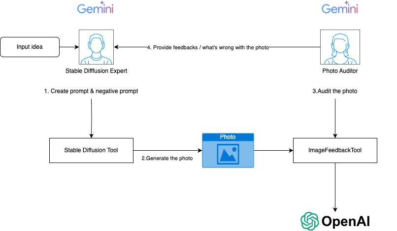

## AI-Powered Image Generation Pipeline with CrewAI and Stable Diffusion

This project explores the automation of high-quality image generation using a combination of AI technologies. It addresses the challenges of crafting detailed prompts for Stable Diffusion and refining generated images to achieve desired results.

### Problem Statement

Generating high-quality images with Stable Diffusion often involves a tedious iterative process:

* **Prompt Engineering:** Formulating a detailed prompt that accurately captures the desired image is crucial but challenging.
* **Image Refinement:**  Generated images may contain artifacts, anatomical inconsistencies, or other imperfections requiring prompt adjustments, parameter tuning, and multiple generation attempts.

This project aims to streamline this workflow, particularly for users who may not possess extensive design expertise and seek a more automated approach.

### Solution Overview

This project leverages CrewAI, a platform for building AI agent workflows, to create an image generation pipeline.  The pipeline consists of two primary agents:

1. **Stable Diffusion Expert:**
    - Receives an initial image idea as input.
    - Crafts a detailed prompt, including negative prompts, to guide Stable Diffusion.
    - Utilizes the AUTOMATIC1111 web UI API to generate an image based on the crafted prompt.
    - The `sd_tool.py` script handles the integration with Stable Diffusion.

2. **Photo Auditor:**
    - Evaluates the generated image for quality and adherence to the initial idea.
    - Employs the `ImageFeedbackTool` (implemented in `image_feedback_tool.py`) to submit the image to OpenAI's GPT-4 for analysis and feedback.
    - If the image meets the quality criteria, the process concludes. Otherwise, the feedback is relayed back to the Stable Diffusion Expert for prompt refinement and image regeneration.



### Getting Started

1. **Environment Setup:**
    - Install the required dependencies: `pip install -r requirements.txt`
    - Set up your Google Cloud API key and OpenAI API key as environment variables:
        ```bash
        export GOOGLE_API_KEY=<your-google-api-key>
        export OPENAI_API_KEY=<your-openai-api-key>
        ```

2. **Configure Image Idea:**
    - Modify the `create_photo_task` within `pipeline.py` to specify your desired image idea:
        ```python
        create_photo_task = Task(
            description="""Generate photo for the idea: 'Your image idea here'""",
            expected_output='Prompt and negative prompt in markdown format within a code block, and the path of the generated image',
            agent=stable_diffusion_expert
        )
        ```

3. **Run AUTOMATIC1111:**
    - Ensure you have the AUTOMATIC1111 Stable Diffusion web UI set up and running with the API enabled. 
    - Download and configure desired checkpoints (e.g., ChilloutMix, DreamShaper) for optimal image quality.
    - Start the web UI with API access:
        ```bash
        ./webui.sh --listen --api 
        ```

4. **Execute the Pipeline:**
    - Run the pipeline script: `python pipeline.py`

Generated images will be saved to the `output/txt2img` directory. Sample output images are included in the repository for reference. 

Enjoy!